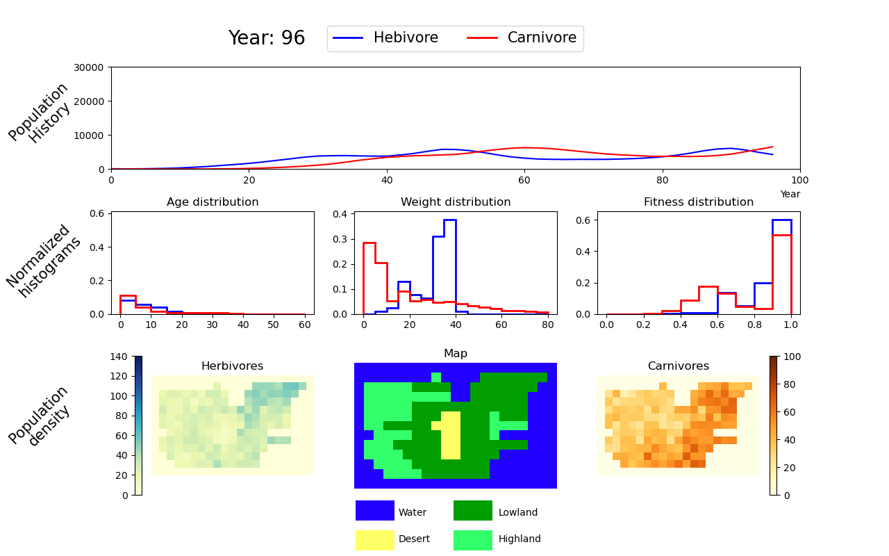
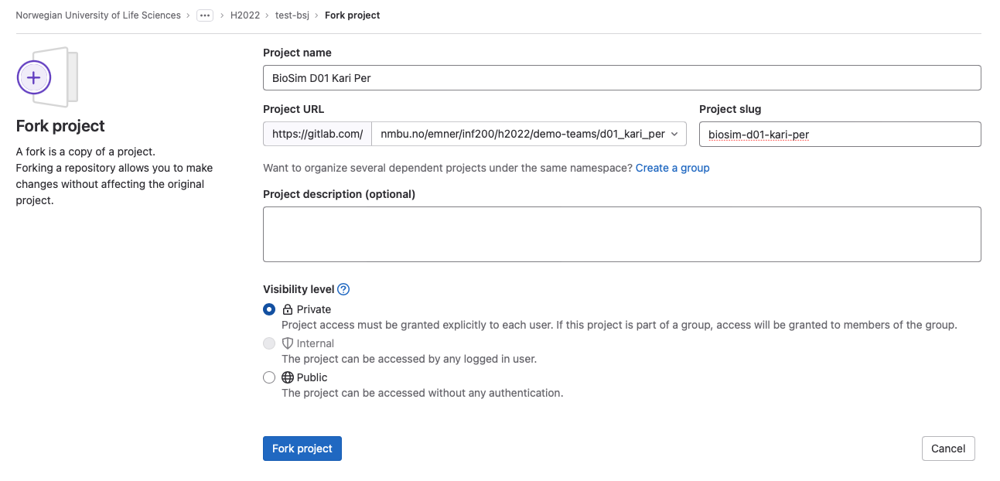

# BioSim: Modelling the ecosystem of Rossumøya

## About The Project


## Prerequisites
To use this software you need to have `Python 3.11` and `The Python Standard library`.
If you want to run the included tests, then you also need the python package: `pytest`.

## Installation

## Usage

An example code of how to use this package is shown below.


```python
from biosim.simulation import BioSim
geogr = """\
               WWWWWWWWWWWWWWWWWWWWW
               WWWWWWWWHWWWWLLLLLLLW
               WHHHHHLLLLWWLLLLLLLWW
               WHHHHHHHHHWWLLLLLLWWW
               WHHHHHLLLLLLLLLLLLWWW
               WHHHHHLLLDDLLLHLLLWWW
               WHHLLLLLDDDLLLHHHHWWW
               WWHHHHLLLDDLLLHWWWWWW
               WHHHLLLLLDDLLLLLLLWWW
               WHHHHLLLLDDLLLLWWWWWW
               WWHHHHLLLLLLLLWWWWWWW
               WWWHHHHLLLLLLLWWWWWWW
               WWWWWWWWWWWWWWWWWWWWW"""


ini_herbs = [{'loc': (3, 2),
              'pop': [{'species': 'Herbivore',
                       'age': 5,
                       'weight': 20}
                      for _ in range(150)]}]
ini_carns = [{'loc': (3, 2),
              'pop': [{'species': 'Carnivore',
                       'age': 5,
                       'weight': 20}
                      for _ in range(40)]}]
sim = BioSim(island_map=geogr, ini_pop=ini_herbs, img_dir='images')

sim.simulate(num_years=100)
sim.add_population(population=ini_carns)
sim.simulate(num_years=100)

sim.make_movie()
```

First you import the BioSim class from the simulation module. 
Then you create a string that represents the map of the island. 
The map is a grid of cells, where each cell is either water (W), desert (D), lowland (L) or highland (H). 
The map is surrounded by water. The map is given as a string, where each line represents a row of cells. 
The upper left corner of the map has coordinates (0, 0). The map string is given as a parameter to the BioSim class. 
To add animals to the simulation, you create a list of dictionaries as shown above. 
Create an instance of the BioSim class and use the add_population method to add the animals to the simulation.
The simulation is run by calling the simulate method, which will create a live visualization of the simulation.
The simulation can be run for a given number of years by giving the num_years parameter to the simulate method.
After which you can eiter add more animals to the simulation and continue the simulation or stop. 
If you choose to give a img_dir parameter to the BioSim class, 
then the simulation will save images of the simulation to the given directory. If you call the make_movie method, 
then the images will be combined into a video. Here is a picture of live visualization of the simulation:



### Valid params
The following parameters can be given to the BioSim class:
- island_map: A string representing the map of the island. 
Must be a rectangle of cells, where each cell is either water (W), desert (D), lowland (L) or highland (H). 
The map is surrounded by water.
- population: A list of dictionaries representing the initial population of animals on the island. 
Includes the following keys:
    - loc: The location of the cell where the animals are placed. 
    The location is given as a tuple of the x and y coordinates of the cell. 
    - Note that the animals cannot be placed in water.
    - pop: A list of dictionaries representing the animals in the population. 
    Includes the following keys:
        - species: The species of the animal. Can be either Herbivore or Carnivore.
        - age: The age of the animal. Must be a non-negative integer.
        - weight: The weight of the animal. Must be a positive integer.


1. Be sure that you are logged into Gitlab.
1. One of the partners clicks the `Fork` button.
1. Fill in the form that appears as follows (see also figure below):
   - Project name: `BioSim Uxx FirstName1 FirstName2`  Here, `xx` is your group number (with leading zero!) and `FirstName1` and `FirstName2` your first names as in the group name.
   - In the project URL, in the "Select a namespace" pull-down menu, select your Gitlab group `Axx_FirstName1_FirstName2`. 
   - Make sure that the "Project slug" is
     `biosim-uxx-firstname1-firstname2` without any spaces or
     additional hypyens. 
		- **NB: Gitlab will insert a `-` between `u` and the digits
          `xx`. Remove the `-`!**
   - You can add a project description.
   - Select visibility level `Private`
1. The project is now created inside your group on Gitlab.
1. Both partners clone the project to their computers.
1. One partner shall replace this README.md with an initial text of your own and delete `fork_example.png`.


