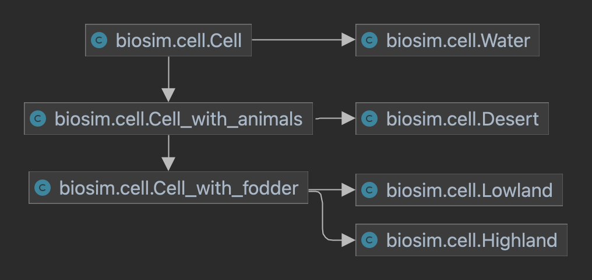

Code documentation
===================

Simulation
-------------
The simulation is run by the BioSim- and Graphics-class.
BioSim simulates the ecosystem on the Island, Graphics visualizes the data from the simulation.
If you run the simulation once, you simulate one year.

BioSim class
+++++++
BioSim class is the top-level interface to BioSim package. It implements a complete simulation
of the ecosystem. Choose between multiple different parameters to adjust your simulation and preferred output.

.. autoclass:: biosim.simulation.BioSim
    :inherited-members:

Graphics class
++++++++
Graphics provides graphics support for BioSim.
This module was inspired by RandVis package by Hans Ekkehard Plesser

* This module requires the program ``ffmpeg`` or ``convert`` available from `<https://ffmpeg.org>` and `<https://imagemagick.org>`.
* You can also install ``ffmpeg`` using ``conda install ffmpeg``
* You need to set the  :const:`_FFMPEG_BINARY` and :const:`_CONVERT_BINARY` constants below to the command required to invoke the programs
* You need to set the :const:`_DEFAULT_FILEBASE` constant below to the directory and file-name start you want to use for the graphics output files.

.. autoclass:: biosim.graphics.Graphics
    :inherited-members:

Island class
----------

.. automodule:: biosim.island
    :inherited-members:

Cell class
----------
Each cell in the Cell class are bits of the Island, together they make up the Island.
Structure of the cell class is shown below. Water, Dessert, Lowland and Highland are
using the Cell class as a master class. All cells points to the same main class, Cell.

Water class
+++++

.. autoclass:: biosim.cell.Water
    :inherited-members:

Desert class
+++++++

.. autoclass:: biosim.cell.Desert
    :inherited-members:

Lowland class
+++++++

.. autoclass:: biosim.cell.Lowland
    :inherited-members:

Highland class
++++++++

.. autoclass:: biosim.cell.Highland
    :inherited-members:

Animals class
----------

Herbivore class
++++++++++++++++

.. autoclass:: biosim.animals.Herbivore
    :inherited-members:

Carnivore class
+++++++++++++++

.. autoclass:: biosim.animals.Carnivore
    :inherited-members:

